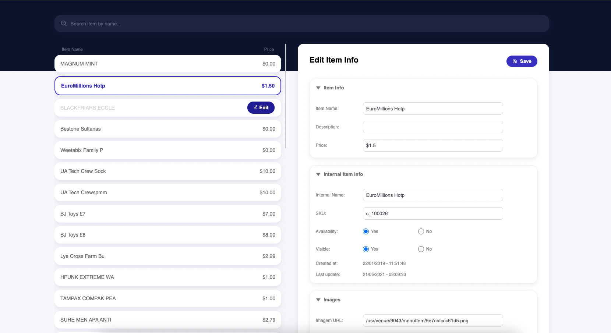
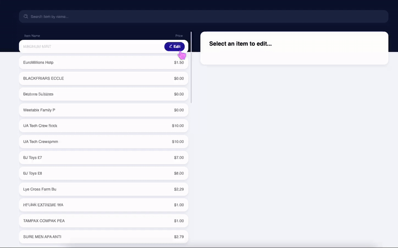

<h4 align="center"><a href="https://dashboard-menu-msawaguchi.netlify.app/" target="_blank">Live Preview</a></h4>
<p align="center">
  
</p>

## About 

React application to allow managers managing a menu in a restaurant.
Some features:
- Dynamic rendering of menu items directly from the URL.
- Implemented infinite scroll to optimize page loading by lazily rendering items.
- Enhanced user interaction: Hovering over an item displays an "edit" button, providing instant access to detailed item information on the right side of the page.
- Search menu by item name.
- Mobile friendly.

<p align="center">
  
</p>

## How To Use

To clone and run this application, you'll need [Git](https://git-scm.com) and [Node.js](https://nodejs.org/en/download/) (which comes with [npm](http://npmjs.com)) installed on your computer. From your command line:

```bash
# Clone this repository
$ git clone https://github.com/msawaguchi/qskitchen.git

# Go into the repository
$ cd qskitchen

# Install dependencies
$ npm install

# Run the app
$ npm start
```

## Technologies

- React
- Typescript
- ES6+
- SCSS